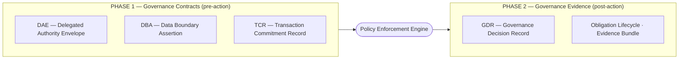

# Agent Governance Framework

**An open specification for portable, verifiable governance contracts for autonomous AI agent transactions.**

---

## The Problem I Identified

AI agents are moving from assistive to autonomous. They are booking travel, placing purchase orders, accessing billing data, negotiating with external suppliers, and taking actions with financial and legal consequences — across organizational boundaries, without human review of each individual decision.

The infrastructure layer answered authentication. Gateways, JWT tokens, CEL rules, and OPA policies answer: *was this API call permitted by policy?*

None of them answer:

- Was this agent authorized to commit to *this specific transaction*, on behalf of *this specific principal*, within the limits the human set at delegation time?
- What data may leave this organization, to which regions, under what conditions?
- What obligations must be fulfilled for this transaction to be considered complete?
- What signed, portable, cross-org-verifiable proof exists after the agent acted?

These are governance questions. I believe they require a dedicated governance layer. AGF is my proposal for what that layer should look like.

---

## Two Enterprise Drivers

Two distinct enterprise problems motivate the need for a governance contract layer.

**Driver 1: Cross-organizational boundary verification.** When Company A's AI agent interacts with Company B's systems, Company B cannot call Company A's internal authorization server to verify the agent's permissions. It sits behind a firewall, requires authentication, and may be unavailable. Company B needs a portable, offline-verifiable governance artifact — one that proves the agent was authorized, by whom, to do what, within what limits — without requiring connectivity to Company A.

**Driver 2: Auditability under emerging AI governance frameworks.** Organizations operating under AI risk frameworks (EU AI Act), data processing obligations (GDPR), or internal audit requirements increasingly need to demonstrate that autonomous agent actions were authorized, bounded, and traceable. A signed governance artifact gives compliance teams, auditors, and counterparties something concrete to evaluate. "The agent sent a request" is not a satisfactory audit response.

Either driver alone creates pressure to address the governance gap. Together, they make the case compelling — and I'd expect this pressure to grow as autonomous agents move from prototype to production.

---

## How AGF Works: Two Phases

AGF governs agent transactions in two phases:



The primitives are **portable pre-signed documents**. They travel with the agent across trust boundaries. They are verified offline — no live call to the issuing organization. Company B checks the Ed25519 signature and evaluates the governance terms locally.

**Offline trade-off:** DAE revocation requires delivering an updated document to all enforcement points; if Company A cannot reach Company B's enforcement point, revocation is not guaranteed. TCR lifecycle is recomputed at query time from timestamps — stored state and effective state can diverge, and clock skew between enforcement points may produce different evaluations of the same record. Both are known limitations documented in their respective specs.

See [docs/architecture.md](docs/architecture.md) for the full system diagram, enforcement flow, and DAE issuance paths.

---

## What Existing Tools Don't Cover

Most organizations reach for gateways, OPA policies, JWT tokens, and audit logs. These are the right tools for policy enforcement *within* an organization. They break at the boundary.

AGF proposes a boundary layer to fill what I identified as the gap:

| Problem | Existing tool | Where it breaks | AGF |
|---|---|---|---|
| Spending limit enforcement | AP2 IntentMandate budget field | Natural language string — can't be machine-validated | DAE `constraints.max_value` + `currency` — enforced before payment executes |
| Cross-org authorization | GNAP token / JWT | Requires live AS call; breaks at trust boundary | DAE — offline-verifiable Ed25519 signature |
| Data boundary compliance | OPA policy | Requires live OPA instance; org-local | DBA — portable signed document; verified without live call |
| Obligation lifecycle | XACML Obligations | Synchronous only; no persistent lifecycle | TCR — async, time-aware, breach-detected at query time |
| Post-action audit chain | Logging / OTel | Unstructured; not cross-org portable | GDR (design target) — signed portable evidence record; OCSF and Article 12 field mappings in design |

AGF does not replace gateways, OPA, or GNAP. It defines the governance contract layer that these tools enforce against. See [docs/standards-alignment.md](docs/standards-alignment.md) for the full mapping.

---

## Phase 1: The Three Governance Primitives

### DAE — Delegated Authority Envelope

A portable pre-signed delegation contract. Borrows vocabulary from GNAP (RFC 9635) and adds agent-governance extensions. Architecturally distinct from GNAP: DAE is an offline-verifiable document evaluated at any enforcement point without server connectivity.

**What it answers:** Who authorized this agent, to do what, on behalf of whom, under what spending constraints, until when — verifiable by any party without calling back to the issuing organization.

```json
{
  "context_id": "txn-2026-ctx-8f3a",
  "delegation_id": "dae-2026-0042",
  "principal": "cfo@company-a.com",
  "delegate": "procurement-agent-7f",
  "allowed_actions": ["purchase_order:create", "quote:request"],
  "constraints": {
    "max_value": 5000,
    "currency": "USD",
    "jurisdiction": "US"
  },
  "expiry": "2026-04-15T00:00:00Z",
  "revocable": true,
  "revoked": false,
  "audit_required": true
}
```

If the agent attempts a $6,000 transaction: `ERR_DAE_MAX_VALUE_EXCEEDED` — before any money moves.

→ [DAE Specification](spec/governance-primitives/delegated-authority-envelope.md) · [DAE Schema v0.3](spec/dae-schema-v0.3.json) · [DAE Issuance Service](spec/governance-primitives/dae-issuance-service.md)

---

### DBA — Data Boundary Assertion

A portable pre-signed data governance contract. Structurally distinct from AuthZEN and OPA/Rego, which are runtime APIs requiring live connectivity.

**What it answers:** What data may cross which boundaries, to which regions, with what redaction requirements — verifiable by Company B without calling Company A's data governance system.

**Key fields:** `data_classes[]`, `permitted_operations[]`, `allowed_regions[]`, `egress_allowed`, `max_retention_hours`, `redaction_required[]`

→ [DBA Specification](spec/governance-primitives/data-boundary-assertion.md) · [DBA Schema v0.2](spec/dba-schema-v0.2.json)

---

### TCR — Transaction Commitment Record

The most novel Phase 1 primitive. Extends W3C PROV's provenance model with a commitment lifecycle that W3C PROV and XACML 3.0 Obligations do not provide.

**What it answers:** What obligations were promised for this transaction, were they fulfilled on time, and is the evidence preserved for dispute adjudication.

**Key fields:** `commitments[].due_by` (deadline), `commitments[].fulfilled` (state), `status` (pending → fulfilled / breached / revoked), `dispute_window_end`, `evidence_refs[]`

**Pull model:** Lifecycle is computed at query time from `due_by` timestamps. No daemon required. An enforcement point anywhere can independently determine whether a TCR is breached — including offline.

→ [TCR Specification](spec/governance-primitives/transaction-commitment-record.md) · [TCR Schema v0.2](spec/tcr-schema-v0.2.json)

---

## Phase 2: Governance Evidence

Phase 2 is in design. The **Governance Decision Record (GDR)** is the proposed AGF evidence format for post-action governance — a signed, portable record of what was evaluated, what was decided, and the full authority chain behind that decision.

**GDR is a design target, not a finalized spec.** The schema is not yet published; several open questions remain (signature granularity, `conditional` decision semantics, primary format). See [GDR specification](spec/governance-evidence/governance-decision-record.md) for the full list of open questions.

Design-target coverage:
- EU AI Act Article 12 logging (design target — field mapping in v0.3; legal review required)
- OCSF Authorization Event mapping (SIEM integration — planned)
- OSCAL Assessment Results mapping (GRC integration — planned)
- Offline-verifiable cross-org audit chain

→ [GDR Design Target](spec/governance-evidence/governance-decision-record.md) · [ROADMAP — Phase 2 milestones](ROADMAP.md)

---

## Protocol Validation Evidence

I tested AGF's design against two production agent protocols to check whether the gaps I identified are real, and whether AGF addresses them without duplicating what the protocols already do well. These tests show where specific fields are absent in each protocol — they don't prove AGF is the only possible solution, but they do show the gap is concrete and not hypothetical.

### AP2 (Google Agent Payments Protocol)

**Scenario:** AI shopping agent tasked with booking a hotel. User states "budget €900" in the delegation. Between quote and payment execution, hotel's dynamic pricing updates to €930. The agent proceeds. User disputes.

**What AP2 gets right:** Three-mandate evidence chain (IntentMandate → CartMandate → PaymentMandate), merchant price lock, `user_cart_confirmation_required` control, dispute liability table.

**The gap:** `IntentMandate` has no machine-readable budget field. The €900 budget lives in `natural_language_description` only. Nothing in the AP2 protocol prevents the agent from creating a PaymentMandate for €930. Dispute adjudication requires NLP interpretation of free text.

**AGF's answer:** DAE `constraints.max_value: 900, currency: "EUR"` — enforced at the enforcement point before the PaymentMandate is created. `ERR_DAE_MAX_VALUE_EXCEEDED` before money moves. Machine-readable, not free text.

→ [Full AP2 analysis](validation/ap2-hotel-booking/)

### TACP (Forter Trusted Agentic Commerce Protocol)

**Scenario:** AI procurement agent exceeds its authorized purchase amount — $8,500 against a $5,000 mandate.

**What TACP gets right:** Strong agent authentication (JWE-encrypted credentials), fraud signal sharing, risk assessment infrastructure.

**The gap:** TACP has no `mandate`, `spending_limit`, or `max_authorized_amount` field at any level. It is an agent authentication protocol; mandate enforcement is outside its defined scope. Nothing in TACP verifies whether the agent was authorized to spend $8,500 — only that it is authenticated.

**AGF's answer:** Same as AP2. DAE carries the mandate as a machine-enforceable contract. TACP and DAE are complementary: TACP authenticates the agent, DAE enforces the authorization terms.

→ [Full TACP analysis](validation/tacp-mandate-exceeded/)

---

## Integration with Existing Infrastructure

AGF integrates with, not replaces, the tools enterprises already run.

**With agentgateway:** agentgateway evaluates DAE and DBA offline at the enforcement point, then calls its AuthZEN PDP for live policy evaluation. Both checks must pass. agentgateway creates the TCR and GDR evidence records. → [Protocol comparison: agentgateway](docs/comparisons/agf-vs-agentgateway.md)

**With OPA/Rego:** OPA evaluates DAE and DBA constraints. A reference Rego evaluator is a design target for the AGF conformance suite. → [Protocol comparison: OPA](docs/comparisons/agf-vs-opa.md)

**With GNAP/OAuth:** DAE issuance integrates with existing enterprise GNAP or OAuth 2.0 AS infrastructure. The AGF Issuance Service can route authorization through an existing AS — no new authorization infrastructure required. → [DAE Issuance Service](spec/governance-primitives/dae-issuance-service.md)

**With AuthZEN:** DBA is the portable governance contract; AuthZEN is the live PEP→PDP API. Same enforcement point uses both. → [Protocol comparison: AuthZEN](docs/comparisons/agf-vs-authzen.md)

---

## Protocol Comparisons

Detailed side-by-side analysis of how AGF relates to each relevant standard — what each standard does well, where it ends, and how AGF and the standard work together:

| Document | Covers |
|---|---|
| [AGF and GNAP](docs/comparisons/agf-vs-gnap.md) | DAE vocabulary borrowing, structural difference, GNAP + DAE enterprise pattern |
| [AGF and AuthZEN](docs/comparisons/agf-vs-authzen.md) | Portable contract vs live PDP API, coexistence pattern |
| [AGF and OPA](docs/comparisons/agf-vs-opa.md) | Document vs policy engine, Rego evaluator design target |
| [AGF and agentgateway](docs/comparisons/agf-vs-agentgateway.md) | PEP integration, enforcement flow, AGF as governance layer above gateway |
| [AGF and Policy Cards](docs/comparisons/agf-vs-policy-cards.md) | Academic preprint comparison, implementability differentiation |
| [AGF and PEAC](docs/comparisons/agf-vs-peac.md) | Framework positioning, scope differences |

---

## Standards This Framework Builds On

AGF does not reinvent what is already standardized.

| Standard | Where AGF Aligns |
|---|---|
| GNAP (RFC 9635) | DAE borrows GNAP vocabulary; GNAP + DAE issuance is a valid enterprise pattern |
| W3C PROV | TCR extends PROV Activity/Agent/Entity model with commitment lifecycle |
| XACML 3.0 Obligations | TCR fills the XACML async lifecycle gap |
| AuthZEN (OpenID) | DBA and AuthZEN coexist at the same enforcement point — different architecture |
| OPA / Rego | OPA evaluates DAE/DBA constraints; Rego reference evaluator is a design target |
| OSCAL (NIST) | GDR maps to OSCAL Assessment Results for GRC integration |
| OCSF | GDR produces OCSF Authorization Event for SIEM integration |
| EU AI Act Article 12 | GDR designed to support Article 12 logging requirements for high-risk AI systems |
| NIST SP 800-188 | DBA `data_classes` vocabulary aligned |

Full field-level mappings: [docs/standards-alignment.md](docs/standards-alignment.md)

---

## What Is Shipped

**Current release: v0.1** — Phase 1 governance contract layer.

| Component | Status | Location |
|---|---|---|
| DAE Specification v0.3 | ✅ Published | `spec/governance-primitives/delegated-authority-envelope.md` |
| DBA Specification v0.2 | ✅ Published | `spec/governance-primitives/data-boundary-assertion.md` |
| TCR Specification v0.3 | ✅ Published | `spec/governance-primitives/transaction-commitment-record.md` |
| DAE Issuance Service v0.1 | ✅ Published | `spec/governance-primitives/dae-issuance-service.md` |
| DAE JSON Schema v0.3 | ✅ Published | `spec/dae-schema-v0.3.json` |
| DBA JSON Schema v0.2 | ✅ Published | `spec/dba-schema-v0.2.json` |
| TCR JSON Schema v0.2 | ✅ Published | `spec/tcr-schema-v0.2.json` |
| Standards Alignment | ✅ Published | `docs/standards-alignment.md` |
| Architecture + Integration Flows | ✅ Published | `docs/architecture.md` |
| Protocol comparisons (6 pages) | ✅ Published | `docs/comparisons/` |
| Protocol gap evidence (AP2, TACP) | ✅ Published | `validation/` |
| Example payloads | ✅ Published | `examples/` |
| Reference POC (Python + agentgateway) | ✅ Published | `reference-implementation/` |
| Conformance test suite | ✅ Published (bootstrap) | `conformance/` |
| GDR Specification | ⏳ v0.3 milestone | `spec/governance-evidence/governance-decision-record.md` |

---

## Roadmap

**v0.2 — Standards Alignment Profiles**
Formal profile docs making AGF's relationship to GNAP, W3C PROV, and NIST explicit: `DAE-GNAP-Profile-v0.1.md`, `TCR-PROV-Profile-v0.1.md`, typed DAE constraints v0.2.

**v0.3 — Phase 2: Governance Evidence Layer**
GDR spec v0.1, GDR JSON schema, EU AI Act Article 12 field mapping, Audit Package format. Full Phase 1 + Phase 2 governance stack.

**v1.0 — Complete Specification**
All schemas finalized, conformance-tested, reference implementation covering full stack. OTel governance semantic convention proposal.

→ [Full ROADMAP](ROADMAP.md)

---

## Repository Structure

```
spec/
  governance-primitives/        DAE, DBA, TCR, DAE Issuance Service specs
  governance-evidence/          GDR — Phase 2 design targets
  dae-schema-v0.3.json          DAE schema (v0.3: typed spending constraints)
  dba-schema-v0.2.json          DBA schema
  tcr-schema-v0.2.json          TCR schema
docs/
  architecture.md               System flow + enforcement + issuance diagrams
  standards-alignment.md        Complete standards mapping table
  position-paper.md             The structural thesis
  use-cases.md                  Concrete transaction scenarios
  market-positioning.md         What the market has and what it lacks
  comparisons/                  Six protocol comparison pages (AGF vs GNAP, AuthZEN, OPA, agentgateway, Policy Cards, PEAC)
examples/
  a2a/                          DAE example payloads (delegation scenarios)
  dba/                          DBA example payloads (data boundary scenarios)
  tcr/                          TCR example payloads (commitment lifecycle)
validation/
  ap2-hotel-booking/            AP2 protocol gap analysis with code
  tacp-mandate-exceeded/        TACP protocol gap analysis with code
conformance/                    Conformance test suite
reference-implementation/       Python POC with agentgateway integration
```

---

## Status

> **Early-stage open specification under active development.**
>
> No production deployments. No established adopters. Specifications are published openly so the ecosystem can review, challenge, and shape them while the framework is being built.

This is a specification project, not a product. Contributions, challenges, and alternative perspectives are the point.

---

## Contributing

Spec challenge issues — *"this primitive overlaps with existing standard X"* — are especially welcome and will be formally evaluated. Open an issue or discussion.

See [CONTRIBUTING.md](CONTRIBUTING.md) and [docs/standards-alignment.md](docs/standards-alignment.md).

---

## Author

Created by [George Vagenas](https://github.com/gvagenas).

---

## License

[Apache License 2.0](LICENSE)
