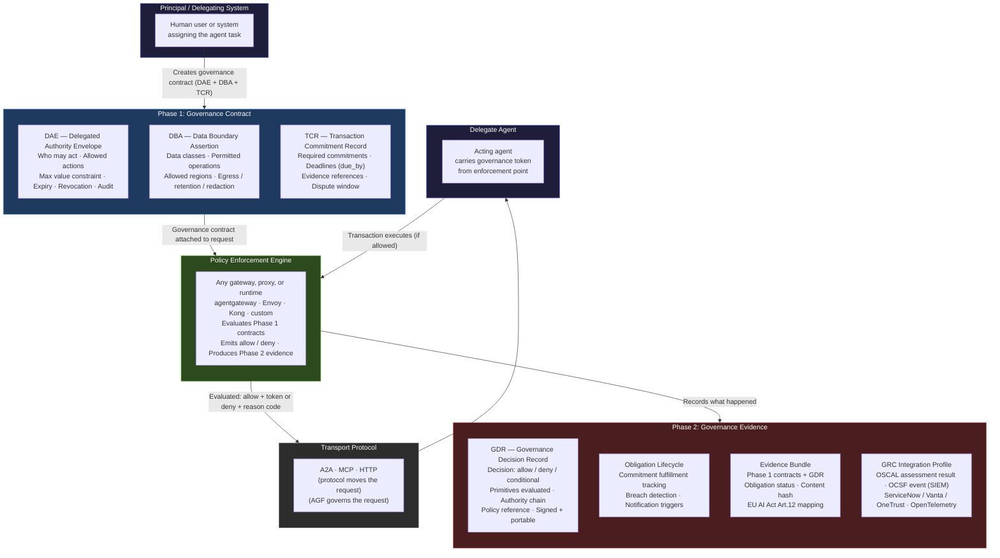
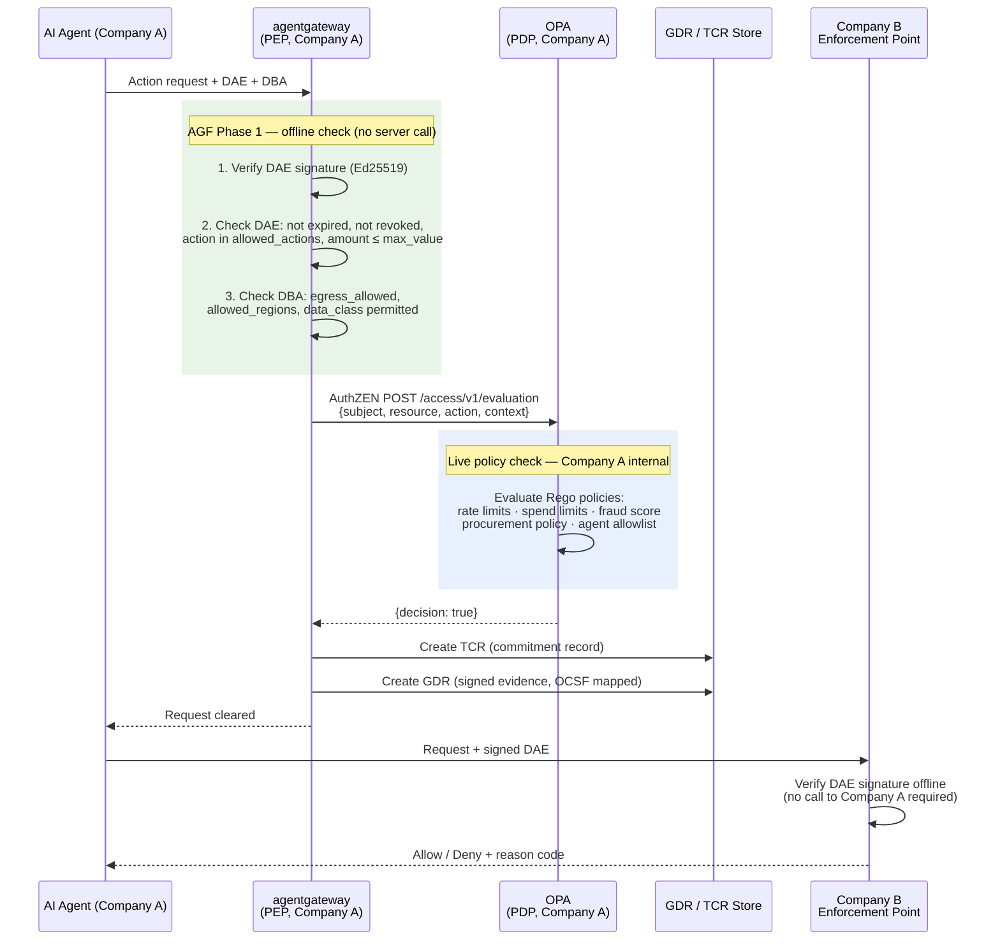
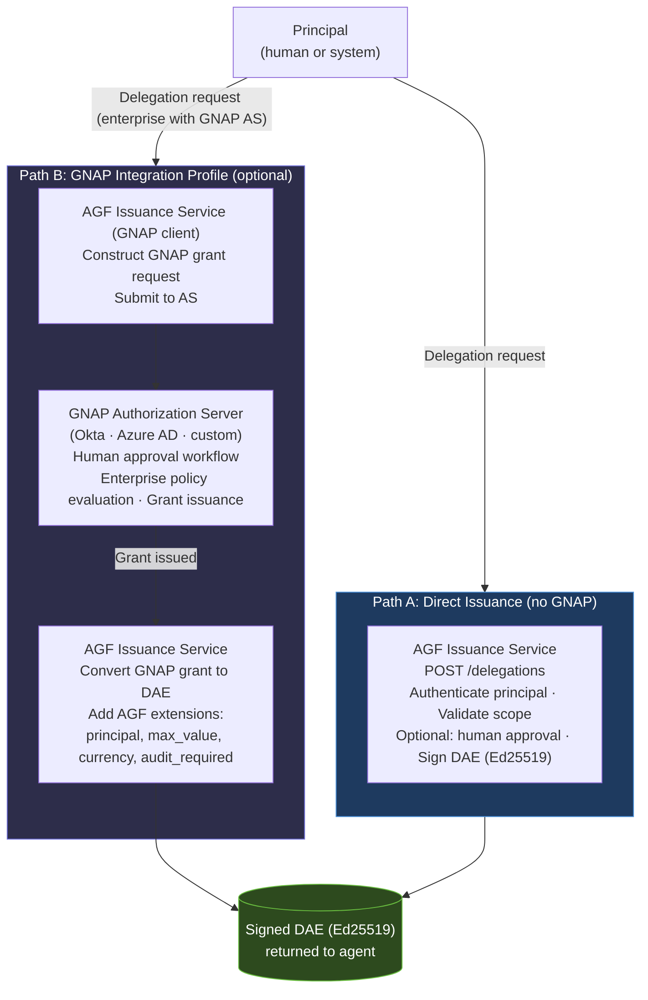
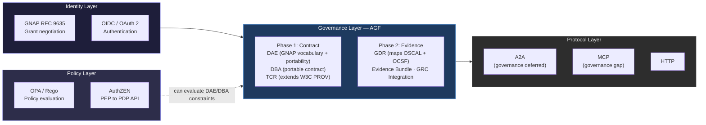
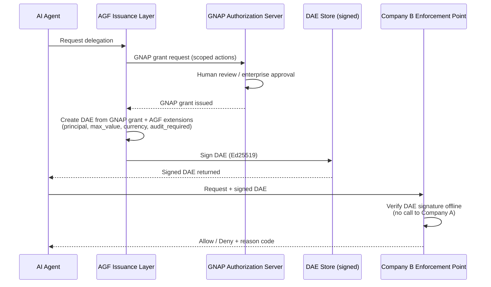

# AGF Architecture

Version: v0.2
Date: 2026-03-15

This document describes where the Agent Governance Framework sits in the agent transaction flow and how its two phases relate to the enforcement infrastructure.

---

## Two-Phase Model

AGF governs agent transactions across two phases:

**Phase 1 — Governance Contract (pre-action):** Defines what should happen before the agent acts. Three portable primitives specify the terms of the transaction.

**Phase 2 — Governance Evidence (post-action):** Defines what did happen after the agent acted. Structured, signed records for audit, dispute, and regulatory compliance.

Between the two phases sits the **Policy Enforcement Engine** — any gateway, proxy, or runtime that evaluates the governance contract and permits or denies the action. AGF does not specify the enforcement engine. AGF defines what the engine enforces.

---

## System Flow Diagram

---

## Key Design Principles

**AGF does not specify the enforcement engine.** Any gateway, proxy, or runtime that can evaluate the three Phase 1 primitives and emit Phase 2 evidence records is a valid AGF enforcement point. The framework defines what is enforced, not which software enforces it.

**Transport protocols are unchanged.** A2A, MCP, and HTTP move the request. AGF governs the request. These concerns are layered, not competing.

**Portability is load-bearing.** All three Phase 1 primitives are portable pre-signed documents that travel with the transaction. They can be evaluated at any enforcement point, across organizational boundaries, without requiring connectivity to the issuing system.

**Phase 1 and Phase 2 are linked by a shared `context_id`.** Every primitive — DAE, DBA, TCR, and GDR — carries the same `context_id` for a given agent transaction. This is the authoritative join key for the evidence chain. An auditor or enforcement point correlates all governance artifacts for a transaction by `context_id`, then resolves each primitive by its type-specific identifier (`delegation_id`, `assertion_id`, `commitment_id`, `record_id`).

---

## Enforcement Flow: agentgateway + AuthZEN + OPA

This section describes the full AGF enforcement flow using agentgateway as the Policy Enforcement Point (PEP) and OPA as the Policy Decision Point (PDP). **The PEP and PDP always belong to the same organization** — here, Company A's outbound enforcement stack checks the agent's governance before it acts. Company B receives the signed DAE and verifies it offline.

**PEP = agentgateway (Company A). PDP = OPA (Company A). AuthZEN = the API spec between them.**

Two complementary checks run in series:

| Question | Mechanism | Requires server? |
|---|---|---|
| Was this agent authorized by a human principal? | AGF Phase 1 — DAE (offline) | ❌ No |
| Is this data access within the authorized scope? | AGF Phase 1 — DBA (offline) | ❌ No |
| Does this action comply with Company A's live policies? | AuthZEN → OPA (online) | ✅ Yes |

AGF Phase 1 proves authorization — cryptographically, offline, cross-org. AuthZEN/OPA enforces live platform policies. Both must pass.

---

## DAE Issuance: Direct and GNAP Integration Paths

DAE issuance does not require GNAP. The **AGF DAE Issuance Service** is the primary issuance mechanism — a simple REST API that accepts delegation requests, optionally triggers a human approval workflow, and returns signed DAE documents. GNAP is an optional integration profile for organizations that already operate GNAP or OAuth AS infrastructure.

**Path A (direct):** The issuance service handles authorization directly. Suitable for any organization regardless of their existing identity infrastructure. No GNAP AS required.

**Path B (GNAP integration):** For organizations with an existing GNAP or OAuth 2.0 AS. The issuance service acts as a GNAP client — it requests a grant, converts the result into a DAE with AGF extensions, and returns the signed artifact. The enterprise AS remains the authorization authority; AGF adds portability.

The resulting DAE is identical regardless of issuance path. Enforcement points verify the DAE signature — they have no visibility into which issuance path was used.

→ [DAE Issuance Service Specification](../spec/governance-primitives/dae-issuance-service.md)

---

## Where AGF Sits Relative to Existing Standards

AGF sits between the identity/authentication layer and the transport/protocol layer. It is not a replacement for GNAP, OPA, or A2A. It is the governance layer that was missing between them.

---

## GNAP + DAE Issuance Pattern (Enterprise Integration Profile)

GNAP is **optional** as a DAE issuance mechanism. For the full picture including direct issuance without GNAP, see the [DAE Issuance section above](#dae-issuance-direct-and-gnap-integration-paths).

For organizations that already operate GNAP or OAuth AS infrastructure, GNAP handles the authorization negotiation and human approval workflow. DAE is the portable governance artifact created from the resulting grant.

**What GNAP handles:** Grant negotiation, human approval workflow, access rights scoping, token issuance by an enterprise-trusted AS.

**What DAE adds:** Portable signed artifact with explicit delegation chain (`principal` → `delegate`), machine-enforceable numeric constraints (`max_value` + `currency`), offline-verifiable revocation state, and cross-org transferability without server connectivity.

This pattern enables reuse of existing GNAP/OAuth infrastructure for the authorization decision while providing the cross-boundary portability that GNAP tokens alone do not offer.

---

## Standards Referenced

| AGF Component | Standard | Relationship |
|---|---|---|
| DAE | GNAP (RFC 9635) | Vocabulary borrowing — DAE reuses GNAP field semantics; architecturally distinct (offline portable artifact vs server-connected token) |
| DBA | AuthZEN, OPA/Rego | Coexist — different architecture (portable contract vs API/engine) |
| TCR | W3C PROV, XACML 3.0 | Extends PROV + fills XACML async lifecycle gap |
| GDR | OSCAL (NIST), OCSF | Maps to both for GRC/SIEM integration |
| Evidence Bundle | EU AI Act Article 12 | GDR targets Article 12 logging requirement coverage (design target — full mapping in v0.3) |

For the full mapping, see [docs/standards-alignment.md](standards-alignment.md).
